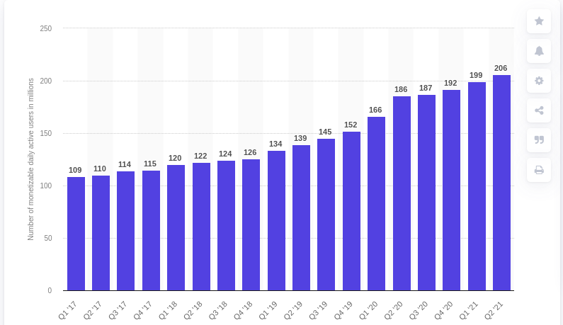

# IV. Marketing Plan 

## 1. Market research

### Size of the industry

#### **Twitter**

Twitter has doubled its user size during the last 5 years, averaging 5 Mio new daily active users every quarter. This trend was accecervated by the pandemic. Average yealry growth is around 15% and half a billion tweets are sent every day.

The demographics of Twitter is comprised by educated, affluent US millenials. The population is mostly male, democrat and many work in the Tech and Startup ecosystem. Other countries were there is a large user base include Japan and India.

**Links:**

* [Chart](https://www.statista.com/statistics/970920/monetizable-daily-active-twitter-users-worldwide/)
* [Demographics](https://www.omnicoreagency.com/twitter-statistics/)

### Trends in the industry

### Target Market & trends

